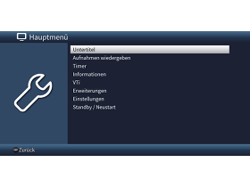
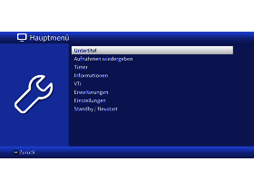
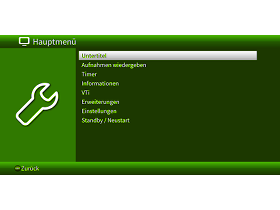

# Enigma² TechniSat Skins
This are Enigma² skins which are inspired by the UI look&feel of the TechniSat STBs and TVs.\
These skins have been tested with VuPlus "Duo²" and "Solo 4k" (VTI Version >= 9.2) but may also work with other Enigma² based STBs.\

## License
 
Enigma2 Skin by <a rel="cc:attributionURL dct:creator" property="cc:attributionName" href="https://github.com/feuster/">Alexander Feuster</a> is licensed under <a href="http://creativecommons.org/licenses/by-nc-sa/4.0/?ref=chooser-v1" target="_blank" rel="license noopener noreferrer" style="display:inline-block;">Attribution-NonCommercial-ShareAlike 4.0 International</a>
 

© 2016-2023 Alexander Feuster 
## Skin previews
| __Name__                         | __Preview__                            |
|:--------------------------------:|:--------------------------------------:|
| TechniSat 1 (original lookalike) |  |
| TechniSat 2 (neon blue)          |  |
| TechniSat 3 (neon green)         |  |
